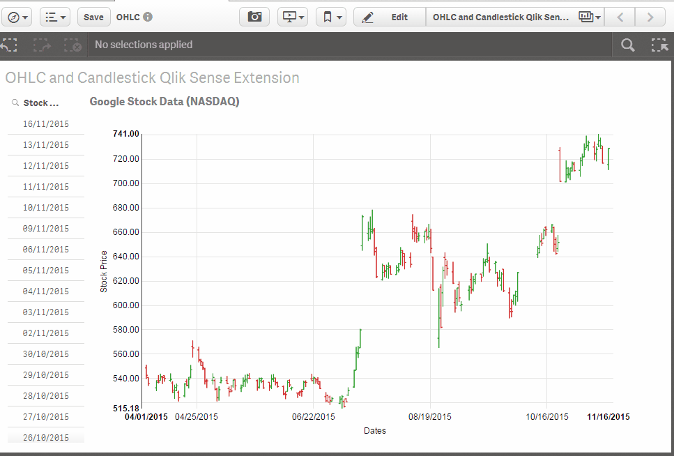

Qlik Sense NVD3 OHLC and Candlestick Extension
===================================
An open-high-low-close chart (also OHLC chart, or simply bar chart) is a type of chart typically used to illustrate movements in the price of a financial instrument over time. Each vertical line on the chart shows the price range (the highest and lowest prices) over one unit of time, e.g., one day or one hour. Tick marks project from each side of the line indicating the opening price (e.g., for a daily bar chart this would be the starting price for that day) on the left, and the closing price for that time period on the right. The bars may be shown in different hues depending on whether prices rose or fell in that period.

A candlestick chart is a style of financial chart used to describe price movements of a security, derivative, or currency. Each "candlestick" typically shows one day; so for example a one-month chart may show the 20 trading days as 20 "candlesticks".
It is like a combination of line-chart and a bar-chart: each bar represents all four important pieces of information for that day: the open, the close, the high and the low.

This extension takes the core implementation of OHLC and Candlestick charts from NVD3 (https://nvd3-community.github.io/nvd3/examples/candlestickChart.html) and adapts it to be used in Qlik Sense.  Note that native Sense Selections are supported, but selections made from the NVD3 chart area currently do NOT send the selections back to Sense.

An example (OHLC.qvf) is included.

Using OHLC and Candlestick charts

Dimensions and Measures (all mandatory)
======================================

Dimension 1 - Stock Date (in Qlik date format)
Measure 1 - Open stock price
Measure 2 - High stock price
Measure 3 - Low stock price
Measure 4 - Close stock price
Measure 5 - Volume
Measure 6 - Adjusted stock price

Properties
==========

Chart Type - OHLC or CandleStick.

Notes
=====

The only dimension (Date) always needs to be top of the Sorting properties of the extension.
The date used as a dimension must be a true Qlik Date.

Future Improvements
===================

1. Connect to Google/Yahoo Finance API and download Stock data that the user selects

License
========

##nvd3.js License

Copyright (c) 2011-2014 [Novus Partners, Inc.][novus]

Licensed under the Apache License, Version 2.0 (the "License");
you may not use this file except in compliance with the License.
You may obtain a copy of the License at

    http://www.apache.org/licenses/LICENSE-2.0

Unless required by applicable law or agreed to in writing, software
distributed under the License is distributed on an "AS IS" BASIS,
WITHOUT WARRANTIES OR CONDITIONS OF ANY KIND, either express or implied.
See the License for the specific language governing permissions and
limitations under the License.

[novus]: https://www.novus.com/

##d3.js License

Copyright (c) 2012, Michael Bostock
All rights reserved.

Redistribution and use in source and binary forms, with or without
modification, are permitted provided that the following conditions are met:

* Redistributions of source code must retain the above copyright notice, this
  list of conditions and the following disclaimer.

* Redistributions in binary form must reproduce the above copyright notice,
  this list of conditions and the following disclaimer in the documentation
  and/or other materials provided with the distribution.

* The name Michael Bostock may not be used to endorse or promote products
  derived from this software without specific prior written permission.

THIS SOFTWARE IS PROVIDED BY THE COPYRIGHT HOLDERS AND CONTRIBUTORS "AS IS"
AND ANY EXPRESS OR IMPLIED WARRANTIES, INCLUDING, BUT NOT LIMITED TO, THE
IMPLIED WARRANTIES OF MERCHANTABILITY AND FITNESS FOR A PARTICULAR PURPOSE ARE
DISCLAIMED. IN NO EVENT SHALL MICHAEL BOSTOCK BE LIABLE FOR ANY DIRECT,
INDIRECT, INCIDENTAL, SPECIAL, EXEMPLARY, OR CONSEQUENTIAL DAMAGES (INCLUDING,
BUT NOT LIMITED TO, PROCUREMENT OF SUBSTITUTE GOODS OR SERVICES; LOSS OF USE,
DATA, OR PROFITS; OR BUSINESS INTERRUPTION) HOWEVER CAUSED AND ON ANY THEORY
OF LIABILITY, WHETHER IN CONTRACT, STRICT LIABILITY, OR TORT (INCLUDING
NEGLIGENCE OR OTHERWISE) ARISING IN ANY WAY OUT OF THE USE OF THIS SOFTWARE,
EVEN IF ADVISED OF THE POSSIBILITY OF SUCH DAMAGE.
